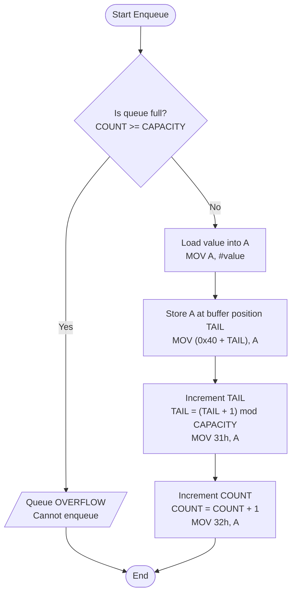
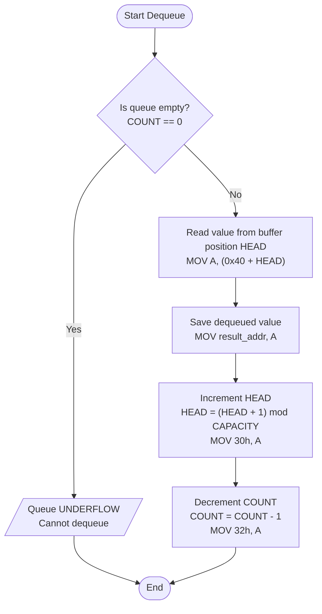
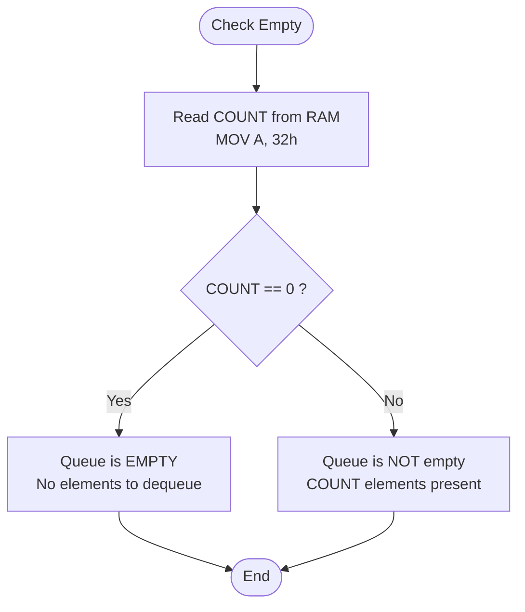
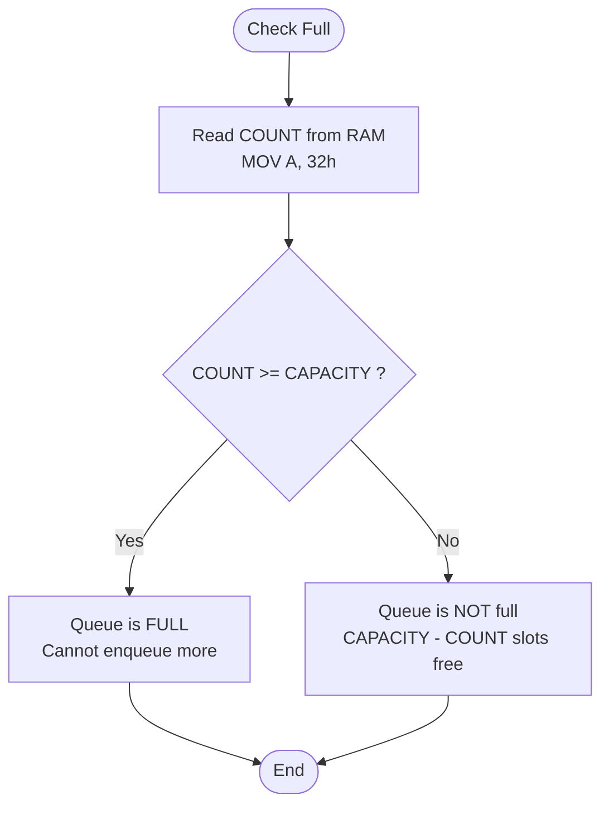
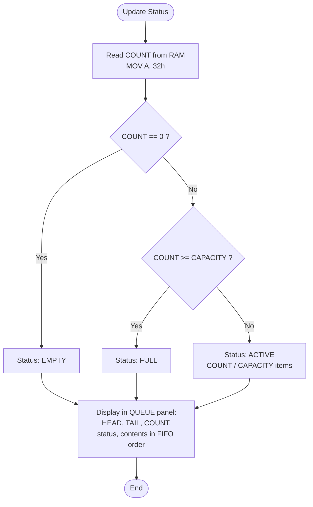

# FIFO Queue — Flowcharts

## Queue Design Overview

The FIFO queue is implemented as a **fixed circular buffer** in Data Memory (RAM), using three metadata pointers stored at dedicated RAM addresses:

| Metadata | RAM Address | Description |
|----------|-------------|-------------|
| HEAD     | `0x30`      | Index of the next element to dequeue |
| TAIL     | `0x31`      | Index of the next free slot for enqueue |
| COUNT    | `0x32`      | Number of elements currently in the queue |

**Buffer:** RAM `0x40`–`0x47` (8 entries, circular)

All operations are built using existing `MOV`, `INC`, and `DEC` instructions — **no new opcodes required**.

---

## 1. Enqueue Operation



---

## 2. Dequeue Operation



---

## 3. Empty Condition Check



---

## 4. Full Condition Check



---

## 5. Status Update



---

## Circular Buffer Diagram

The buffer wraps around: when TAIL or HEAD reaches index 7, the next position is index 0.

```
Buffer indices:   [0] [1] [2] [3] [4] [5] [6] [7]
RAM addresses:    40  41  42  43  44  45  46  47

Example: HEAD=6, TAIL=1, COUNT=3
                   ↑T                      ↑H
Contents:         [CC] [__] [__] [__] [__] [__] [AA] [BB]

FIFO order: AA → BB → CC
```
